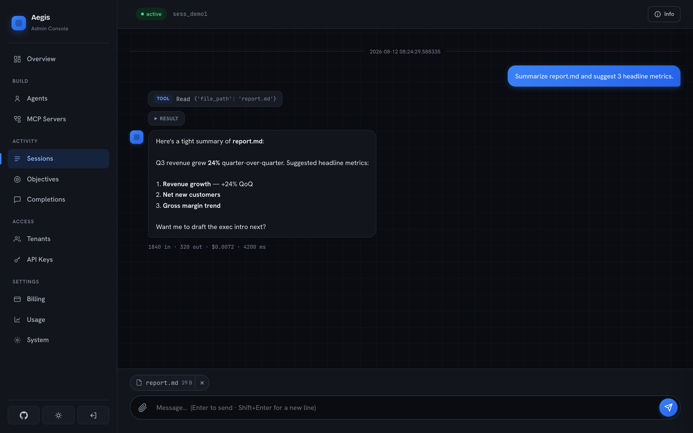
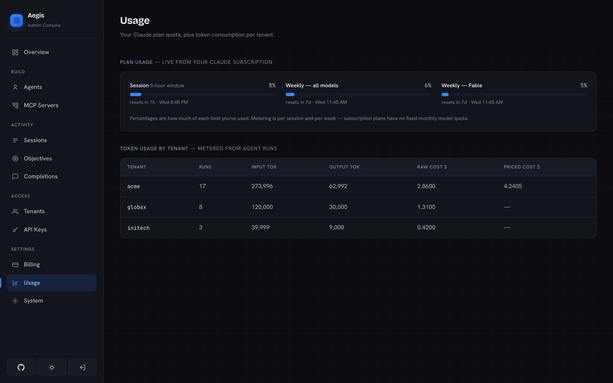
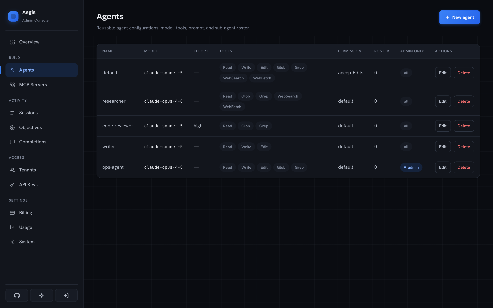
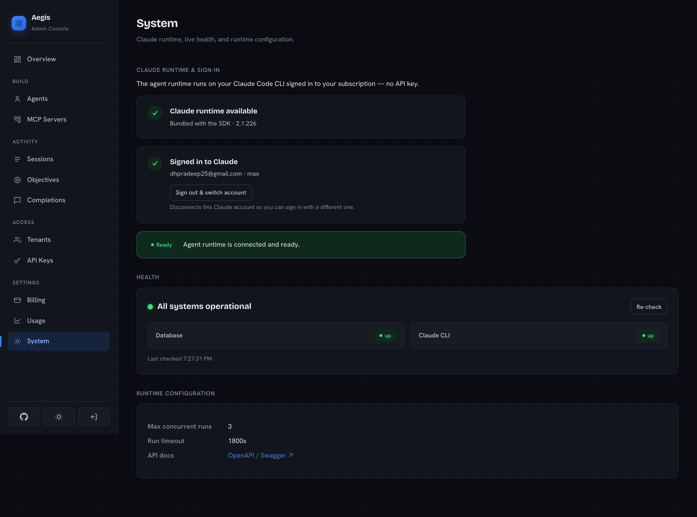

<div align="center">


# Aegis

**Turn your Claude subscription into a multi-tenant agent API — with a dashboard.**

Aegis is a self-hostable server that exposes the [Claude Agent SDK](https://github.com/anthropics/claude-agent-sdk-python)
over your **Claude Max/subscription login** (via the bundled `claude` CLI) instead of an
`ANTHROPIC_API_KEY`. It adds per-tenant API keys, rate limiting, cost tracking,
isolated session workspaces, autonomous objective loops, MCP servers, an
OpenAI-compatible chat endpoint, and a full admin console on top of the SDK — so
several tenants can safely share one subscription-backed agent runtime.

[](LICENSE)


<a href="https://www.producthunt.com/products/aegis-9/reviews/new?utm_source=badge-product_review&utm_medium=badge&utm_source=badge-aegis&#0045;9" target="_blank"></a>

</div>

> [!IMPORTANT]
> **Auth model — read before deploying.** Aegis drives Claude by shelling out to
> a `claude` CLI logged into a personal/Team **subscription**, not by billing an
> Anthropic API key. Anthropic's terms discourage reselling or provisioning
> subscription access to third parties. This project is intended for **personal,
> internal, or trusted-team** use of your own subscription. To run it as a
> commercial multi-tenant service, switch billing to API keys — that's a config
> change in the runtime layer, not a rearchitecture.

## Features

- **Runs on your subscription** — no API key; the Claude CLI is bundled with the SDK, so there's nothing extra to install.
- **Multi-tenant** — tenants, scoped API keys, per-key rate limits (RPM) and daily cost caps.
- **Agents** — configurable model, reasoning effort, allowed tools, MCP servers, permission mode, and autonomous bypass.
- **Sessions** — stateful chats with isolated workspaces, file upload/download, and a live streaming chat UI.
- **Objectives** — autonomous goal-driven loops graded by a separate LLM evaluator until success or budget.
- **MCP servers** — register HTTP/stdio MCP servers and attach them to agents.
- **OpenAI-compatible** — drop-in `POST /v1/chat/completions` and `GET /v1/models`.
- **Usage & billing** — per-tenant token/cost metering **plus your live Claude plan quota** (session + weekly limits).
- **Admin dashboard** — dark/light, responsive, with setup, health, and everything above.

## Quick start (Docker)

```bash
git clone https://github.com/dhpradeep/aegis.git && cd aegis
cp .env.example .env          # then edit ADMIN_PASSWORD and SESSION_SECRET
docker compose up -d --build
```

Open the dashboard at **http://localhost:8000/admin** (password: `ADMIN_PASSWORD`, default `changeme`).

**Sign in to Claude (one time).** Agent runs need a signed-in CLI. In the
dashboard, go to **System** and click *Sign in from here* — open the link,
authorize, and paste the code back. Or from a terminal:

```bash
docker exec -it aegis claude auth login
```

The login is stored in the `claude-config` volume, so it survives restarts and
rebuilds. Then mint an API key under **Access → API Keys** and you're ready.

## Quick start (local)

Requires Python 3.12+ and [uv](https://docs.astral.sh/uv/).

```bash
git clone https://github.com/dhpradeep/aegis.git && cd aegis
uv sync
cp .env.example .env          # edit as needed

# Sign in to Claude once (uses the bundled CLI shipped with the SDK):
uv run claude auth login

# Start the server (migrations run automatically on boot):
uv run aegis
```

Dashboard: **http://localhost:8000/admin** · API docs: **http://localhost:8000/docs**

Override host/port/reload with env vars: `PORT=9000 RELOAD=1 uv run aegis`. The DB
directory is created for you on first run.

## Screenshots

| Streaming chat sessions | Live usage & plan quota |
| --- | --- |
|  |  |

| Configurable agents | System & setup |
| --- | --- |
|  |  |

## Using the API

Authenticate every request with a tenant API key (minted in the dashboard):

```bash
export AEGIS=http://localhost:8000
export KEY=cak_...       # from Access → API Keys
```

**Create a session and send a message:**

```bash
SID=$(curl -s $AEGIS/v1/sessions -H "Authorization: Bearer $KEY" \
  -H 'Content-Type: application/json' \
  -d '{"agent": "default", "title": "My first session"}' | jq -r .session_id)

curl -s $AEGIS/v1/sessions/$SID/messages -H "Authorization: Bearer $KEY" \
  -H 'Content-Type: application/json' \
  -d '{"prompt": "List the files here and summarize them.", "stream": false}'
```

**OpenAI-compatible chat (drop-in):**

```bash
curl -s $AEGIS/v1/chat/completions -H "Authorization: Bearer $KEY" \
  -H 'Content-Type: application/json' \
  -d '{"model": "claude-sonnet-5", "messages": [{"role": "user", "content": "Hello!"}]}'
```

The endpoint speaks the full OpenAI chat protocol, including **client-side
tool calling**: requests that carry `tools` get `tool_calls` back
(`finish_reason: "tool_calls"`), so agent CLIs execute their own tools locally
and loop. `model: "default"` resolves to the tenant (or global) default model.

**Use with opencode** (or any OpenAI-compatible CLI agent) — point a provider
at Aegis in `~/.config/opencode/opencode.json`:

```json
{
  "provider": {
    "aegis": {
      "npm": "@ai-sdk/openai-compatible",
      "name": "Aegis",
      "options": {
        "baseURL": "http://localhost:8000/v1",
        "apiKey": "cak_..."
      },
      "models": { "default": { "name": "Aegis default" } }
    }
  }
}
```

Then `opencode -m aegis/default`. Any model id from `GET /v1/models` works in
place of `default`.

**Usage — per-tenant tokens and your live Claude plan quota:**

```bash
curl -s $AEGIS/v1/usage      -H "Authorization: Bearer $KEY"   # tenant token usage
curl -s $AEGIS/v1/usage/plan -H "Authorization: Bearer $KEY"   # subscription quota
```

Other endpoints: `/v1/objectives`, `/v1/mcp-servers`, `/v1/sessions/{id}/files`,
`/v1/jobs/{id}`. See the interactive docs at `/docs`.

## Configuration

Set via environment or `.env` (see [`.env.example`](.env.example)):

| Variable | Default | Purpose |
| --- | --- | --- |
| `ADMIN_PASSWORD` | `changeme` | Dashboard login — **change it**. |
| `SESSION_SECRET` | — | Cookie signing secret — **change it**. |
| `DATABASE_URL` | `sqlite+aiosqlite:///./data/aegis.db` | Database (SQLite by default). |
| `WORKSPACE_ROOT` | `~/.aegis/workspaces` | Where agent workspaces live (keep outside any git repo). |
| `MAX_CONCURRENT_RUNS` | `3` | Parallel agent-run cap. |
| `RUN_TIMEOUT_S` | `1800` | Per-run timeout. |
| `DEFAULT_RPM` | `30` | Default per-key requests/minute. |
| `DEFAULT_DAILY_COST_USD` | `10.0` | Default per-key daily cost cap. |
| `DEFAULT_MODEL` | `claude-sonnet-5` | Fallback model for the OpenAI endpoint. |
| `MODELS_LIVE_FETCH` | `true` | Fetch the model catalog live from Anthropic. |
| `RUN_MIGRATIONS_ON_STARTUP` | `true` | Apply Alembic migrations on boot. |

## Security

- **Change `ADMIN_PASSWORD` and `SESSION_SECRET`** before exposing the dashboard — the defaults are placeholders.
- The admin login is **brute-force throttled** per real client IP: repeated failures lock that IP out with an escalating cooldown.
- The session cookie is `httponly` + `samesite=lax`. Put the app behind **HTTPS** (a reverse proxy) for any non-local use.
- Tenant API keys are shown once at creation and stored only as hashes.

## Architecture

Layered, FastAPI:

```
app/
├── core/       config, security, errors, logging
├── db/         SQLAlchemy models, engine, migrations runner
├── schemas/    Pydantic request/response models
├── services/   business logic (agents, sessions, objectives, billing, MCP, CLI, usage)
└── api/
    ├── v1/     the public JSON API
    ├── compat/ OpenAI-compatible shim
    └── admin/  dashboard UI + admin API
```

The agent runtime shells out to the bundled Claude CLI with `ANTHROPIC_API_KEY`
stripped from the environment, so it always authenticates via the subscription
login — never an API key.

## Development

```bash
uv sync
uv run pytest           # full test suite
```

Data is SQLite + on-disk workspaces under `WORKSPACE_ROOT`; nothing external is
required to run the tests.

## Contributing

Contributions are welcome via **fork and pull request** — fork the repo, branch
off `main`, keep the tests green, and open a PR. See
[CONTRIBUTING.md](CONTRIBUTING.md) for the full workflow and dev setup.

## License

[Apache License 2.0](LICENSE). Built on the Claude Agent SDK and Claude Code CLI,
distributed by Anthropic under their own terms.
